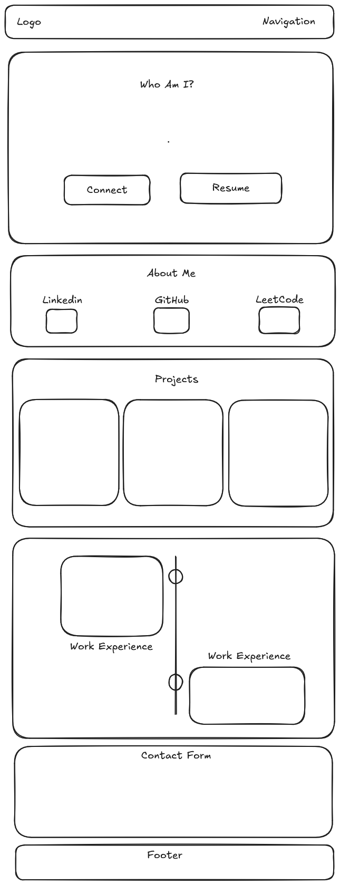

# Personal Portfolio Website

A single-page personal portfolio built with HTML, CSS, and JavaScript.

## PART 1: CONTENT (Answer ALL questions)

1. What is your full name as you want it displayed professionally?

Matthew Douglas

2. What is the purpose of your portfolio website?

The purpose of my portfolio website is to showcase my frontend development skills while presenting myself professionally as a CS student.

3. Who is the target audience (employers, clients, peers, etc.)?

My target audience is employers and peers.

4. What skills do you want to highlight?

I want to highlight the programming languages and tools I'm familiar with, including C++, Java, Python, JavaScript, HTML, CSS, Git, and SQL.

5. What projects or work will you showcase?

I will showcase a sorting algorithm visualizer built in C++, and an intermediate code generator that compiles C++ arithmetic expressions into bytecode. A third project slot is marked as "in progress" rather than a completed piece, to leave room for future work.

6. How will you describe yourself in a short professional bio?

I'm a Computer Science student who enjoys problem-solving and building projects that turn abstract concepts, like compilers and algorithms, into something tangible and interactive.

7. What pages will your site include (Home, About, Projects, Contact, etc.)?

Home, About, Skills, Projects, Work Experience, and Contact.

8. What is your career goal or desired role?

My goal is to work as a software developer where I can build impactful applications and continue growing my technical expertise.

9. What technologies or tools do you have experience with?

I have experience with HTML, CSS, JavaScript, Python, Java, C++, Git, GitHub, and SQL, and I'm familiar with modern development tools and workflows.

10. What achievements or experiences are worth highlighting?

I don't have any notable achievements to highlight at this time.

11. What call-to-action should visitors take (contact you, view projects, download resume)?

Visitors will be able to view my resume and contact me directly through the site.

12. Will you include a resume? In what format?

Yes I will include my resume in PDF format.

13. What social or professional links will you include (GitHub, LinkedIn, etc.)?

I will include GitHub, LinkedIn, and a Leetcode link.

## Wireframe

## PART 2: DESIGN (Answer ALL questions)

1. What overall style will best represent you?

A minimalist, developer-focused style — clean typography, generous whitespace, and subtle animation rather than heavy visual decoration.

2. What color scheme will you use and why?

A dark background with a single accent color (e.g., dark navy/charcoal base with a cyan or teal accent) — this is common in developer portfolios, reads as modern and professional, and keeps focus on content over decoration.

3. What fonts will you use for headings and body text?

A clean sans-serif (e.g., Inter or system-ui) for body text and headings, with a monospace font used sparingly for tech-related labels like skills, to reinforce the developer aesthetic.

4. How will your design reflect your personality or field?

The minimalist, code-inspired styling (monospace accents, grid-based layouts) reflects my background as a CS student, while the clean structure reflects a problem-solving, organized approach to work.

5. What layout will your homepage follow?

A single-page, vertically scrolling layout with anchor-linked navigation, moving through Hero, About, Skills, Projects, Work Experience, and Contact in that order.

6. How will you organize project sections visually?

Projects are displayed in a responsive card grid, each card containing a title, short description, and links to the live site and GitHub repo.

7. Will the site be mobile-friendly? How will you ensure responsiveness?

Yes — the layout uses Flexbox and CSS Grid with a media query breakpoint (around 768px) so multi-column sections stack into a single column on smaller screens.

8. What visual hierarchy will guide visitors?

Large, bold hero text draws the eye first, followed by consistent heading sizes for each section title, with body text and card content sized smaller to keep the structure scannable.

9. How will consistency be maintained across pages?

Since this is a single-page site, consistency comes from reusable CSS classes and custom properties (CSS variables) for color, spacing, and font sizes applied uniformly across every section.

10. How will accessibility be considered?

Sufficient color contrast between text and background, semantic HTML elements (nav, section, header, footer), labeled form fields, and readable base font sizes (16px minimum).

11. Will you use icons, images, or illustrations? Why?

Yes — simple icons for the skills grid and social links, since icons communicate tech stack and platforms faster than text alone and reinforce the developer-focused visual style.

12. What portfolio websites inspired your design?

My design was inspired by sawad.framer.website and aakarsh-devhq.vercel.app, particularly the minimalist hero section with dynamically changing text and the scroll-synced work experience timeline.

## PART 3: INTERACTIVITY (Answer ALL questions)
1. What interactive elements will your site include?

An anchor-linked navigation menu, call-to-action buttons in the hero (Connect, Resume), project links, and a contact form.

2. Will your site include a contact form? How will it work?

Yes — a front-end only contact form that validates required fields and displays a confirmation message on submission, without sending data to a real backend.

3. What JavaScript features will you implement?

A rotating text effect in the hero section, a scroll-based progress indicator for the work experience timeline, and form submission handling with client-side feedback.

4. How will users receive feedback from interactions?

Through visual cues such as button hover states, a status message after submitting the contact form, and the timeline progress bar visibly responding to scroll position.

5. How does interactivity improve the user experience?

It makes the site feel dynamic and engaging rather than static, and gives visitors clear confirmation that their actions (like submitting the form) were registered.

## Tech Stack
- HTML5
- CSS3 (Flexbox, Grid, custom properties)
- Vanilla JavaScript (no frameworks/libraries)

## Project Status
🚧 In progress — built incrementally via feature branches.